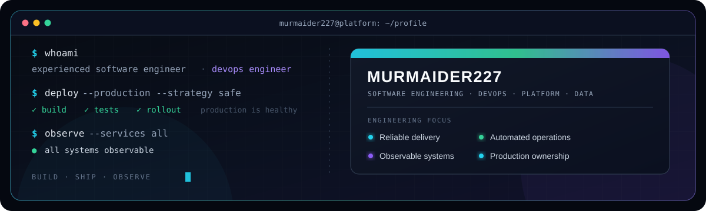

### Experienced Software Engineer & DevOps Engineer

I build and operate production-ready software — from backend services and automation to CI/CD, container platforms, observability, and data systems.

I take ideas from architecture to production and keep them reliable after launch.

## What I bring

<table>
<tr>
<td width="50%" valign="top">
<h3>Software engineering</h3>
Backend systems, automation, bots, web and mobile apps, and game tooling.
</td>
<td width="50%" valign="top">
<h3>Platform & DevOps</h3>
CI/CD, containers, orchestration, infrastructure as code, observability, and production operations.
</td>
</tr>
<tr>
<td width="50%" valign="top">
<h3>Data systems</h3>
Relational, document, and in-memory data stores with pragmatic data modeling.
</td>
<td width="50%" valign="top">
<h3>End-to-end ownership</h3>
Architecture → implementation → delivery → monitoring → continuous improvement.
</td>
</tr>
</table>

## Technical toolkit

### Languages & application development

### DevOps & infrastructure

### Databases & data stores

## Selected work

| Project | What it is | Stack |
|:--|:--|:--:|
| [NovaInstanceTracker-Sirus](https://github.com/murmaider227/NovaInstanceTracker-Sirus) | Dungeon, XP, mob, gold, and instance-limit tracker adapted for Sirus / WotLK 3.3.5a | Lua |
| [telegram-rust](https://github.com/murmaider227/telegram-rust) | Telegram project built in Rust | Rust |
| [Railway Puzzle](https://github.com/murmaider227/railway-puzzle-privacy-policy) | Public privacy and support pages for an iOS puzzle game | HTML |

[**Explore my repositories →**](https://github.com/murmaider227?tab=repositories)

 

Build reliable systems · Automate repetitive work · Observe what matters

